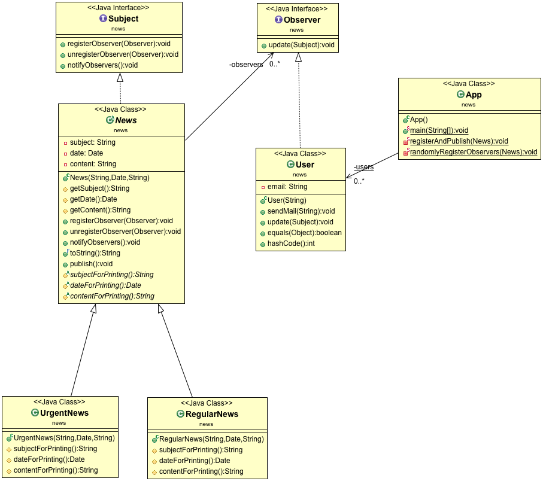

## Zadatak

Napisati aplikaciju koja simulira pretplatu na novine. Korisnik ce sadrzati mejl adresu i metod za slanje mejla korisniku koji ce samo ispisati odgovorajucu poruku (da se salje mejl sa odgovarajucim clankom).

Postoje dve vrste novinskih clanaka: hitne i redovne vesti. Svaki clanak ispisuje prvo svoj naslov, pa datum objave, pa sadrzaj. Hitne vesti ispisuju svoj naslov velikim slovima, dok se redovne vesti uvek objavljuju dan kasnije nego sto su napisane. Novine nakon objavljivanja svakog clanka treba da posalju clanak svim svojim pretplatnicima.

Detektovati potrebne dizajn paterne i implementirati program u Javi.

## Struktura klasa

Observer i Template Method

