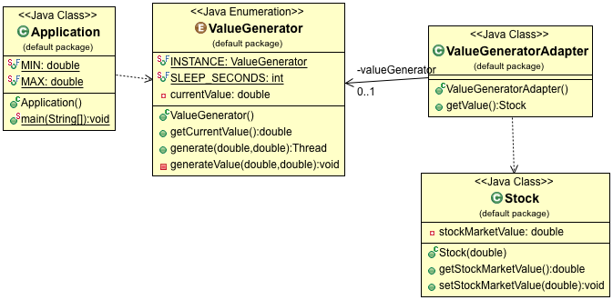

## Zadatak

Napisati aplikaciju koja simulira prikaz vrednosti akcija na berzi. Program na svakih 5 sekundi generise novu random decimalnu vrednost iz nekog opsega, koja predstavlja trenutnu vrednost akcije i ispisuje je na ekran.

Klasa koja generise vrednosti akcija postoji samo jedna na nivou cele aplikacije.

Program takodje podrzava upload trenutnih vrednosti na neku eksternu platformu, medjutim interfejsi se ne poklapaju. Platforma ocekuje da vrednost bude enkapsulirana unutar objekta i da vrednost bude decimalni broj pod imenom _stockMarketValue_.

Detektovati potrebne dizajn paterne i implementirati program u Javi.

## Struktura klasa

Singleton i Adapter

