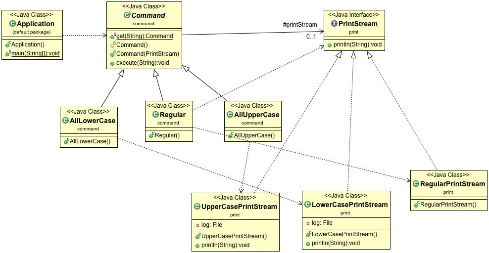

## Zadatak

Napisati program koji ucitava korisnicki unete stringove sve dok se ne unese rec _STOP_.
Program sadrzi dva obogacena `PrintStream`-a, od kojih jedan ispisuje dobijeni token sve velikim, a drugi sve malim slovima. U programu postoje komande `AllUpperCase`, `AllLowerCase` i `Regular`. Ukoliko uneti string pocinje velikim slovom, izvrsava se komanda `AllUpperCase`, ukoliko pocinje malim slovom, izvrsava se komanda `AllLowerCase`, a inace se izvrsava komanda `Regular`, koja samo ispisuje dobijeni string. Svaki od `PrintStream`-ova ispisuje sadrzaj u svoj posebni fajl.

Detektovati potrebne dizajn paterne i implementirati program u Javi.

## Struktura klasa

Decorator i Command

